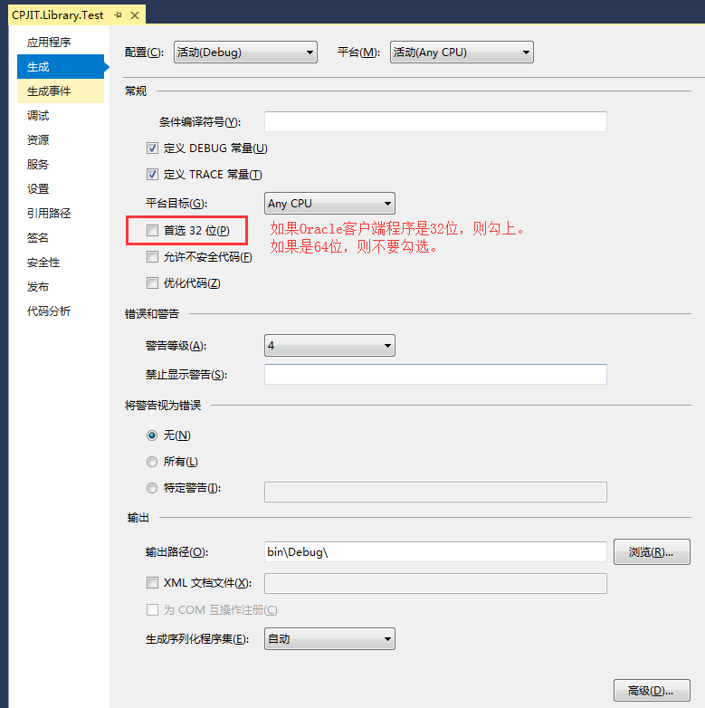

# cpj4net
cpj4net是cpjit团队的C#语言公共库，为开发者封装了一些常用、实用的工具。为项目源码架构的工作提供便利，增强源码的复用，极大的减少代码的重复工作量。    
从版本1.0.2018.0205开始，工程的.NET版本升级到4.5。请使用4.0的码友注意。不仅是微软的官网对.NET的维护至少是4.5.1，而且很多三方库对C#的支持也是从.NET4.5进行了大版本的更新。    


## 目录
[`一. 更新说明`](#一-更新说明)    

[`二. 引用组件`](#二-引用组件)    

[`三. 主要工具类说明`](#三-主要工具类说明)    

[`四. 其它`](#四-其它)

## 一. 更新说明
1. 新增了WCFInvoker。[V1.0.2017.1129]
2. 将数据库交互类接口化。[V1.0.2017.1204]
3. 新增了ActivemqUtil。[V1.0.2017.1207]
4. 去掉了某些小于vs2017版本无法编译的语法糖。    
包装win32 API，录制普通音质音频的工具。[V1.0.2017.1213]
5. 解决TCPClientUtil和TcpServerUtil接收数据粘包的问题。[V1.0.2017.1216]
6. 引入Newtonsoft.Json.dll，封装json格式化工具和字符串是否为json的校验工具。[V1.0.2017.1218]
7. 更新xml工具。遗弃之前的XmlDocumentUtil工具类，更名为XmlUtil，基于更轻更便捷的Linq to xml，即XDocument。[V1.0.2017.1221]
8. 新增OracleClientDBAccess类，该Oracle数据库访问工具是依赖Oracle客户端或者需要安装ODAC。    
数据库访问工具全部接口化，使用起来更加标准化。    
解决TcpClient主动断开连接时服务端收不到断开状态监听的问题。    
解决TcpServer主动断开连接时客户端不友好信息提示的问题。    
修改了部分文件的名称。[V1.0.2018.0105]
9. 新增MongoDB和Redis数据库的访问。    
修改工程的.NET版本，将4.0升级到4.5。[V1.0.2018.0205]
10. 新增properties配置信息自动注入工具。使用方式见CPJ.Library.Test的button8_Click。[V1.0.2018.0323]

## 二. 引用组件
工程中有一个dll文件夹，因为cpj4net中的有一些简单的工具类并非是原生工具，而是对一些工具类进行了二次封装。    
需要引用的dll有：
- ICSharpCode.SharpZipLib.dll
- Ionic.Zip.dll
- Oracle.ManagedDataAccess.dll
- SQLite.Interop.dll
- System.Data.SQLite.dll
- Apache.NMS.ActiveMQ.dll
- Apache.NMS.dll
- Oracle.DataAccess.dll


注意：    
① OrcleDBAccess数据库访问工具不依赖客户端，随时随地使用，在数据库交互效率不要求很高的情况下，该工具能充分的满足需求。   
② OracleClientDBAccess数据库访问工具需依赖Oracle客户端或者安装ODAC，这是基于Oracle提供的Oracle.DataAccess.dll的封装。该库的效率比Oracle.ManagedDataAccess.dll和微软的System.Data.OracleClient的效率都要快。
具体使用哪种Oracle数据库访问工具，根据各位码友居停的环境抉择。

## 三. 主要工具类说明
### 1. IniUtil.cs
#### 1.1 public static void WriteINI(string section, string key, string value, string path)
`说明`  写入ini配置信息。如果配置文件的section不存在将添加，如果存在，将修改或添加key&value。    

`参数`    
- section：表示一组字典的标识符。
- key：表示配置信息的键。
- value：表示配置信息的值。
- path：表示ini配置文件的路径。    

`使用示例`
```
IniUtil.WriteINI("Food", "Apple", "5", "d:/test.ini");
```
上面的代码执行后，d盘中test.ini文件里的内容为：
```
[Food]
Apple=5
```

#### 1.2 public static string ReadINI(string section, string key, string def, StringBuilder retVal, int size, string path)
`说明`  读取ini配置信息。    

`参数`    
- section：表示一组字典的标识符。
- key：表示配置信息的键。
- def：表示当没有找到section或者key时，返回的默认值。
- retVal：表示数据缓冲区。
- size：表示缓冲区大小。
- path：ini配置文件的路径。    

`使用示例`    
```
StringBuilder sb = new StringBuilder();
string count = IniOperate.ReadINI("Food", "Apple", "0", sb, 128, "d:/test.ini");
Console.WriteLine("Apple的数量为：" + count);
```
上面的代码执行后的结果为：    
Apple的数量为：5    

### 2. DelegateUtil.cs
#### 2.1 public static void UIHelper(Control control,MethodInvoker func)
`说明`  操作主线程中父类为Control的控件。    

`参数`    
- control：视图中的控件，例如Button，TextBox。不能是ToolStripMenuItem之类的控件，因为它们的父类不是Control。
- func：操作控件的委托方法。    

`使用示例`
```
DelegateUtil.UIHelper(this.textBox, ()=>
{
    this.textBox.Text = "Hello World！";
});
```


### 3. WcfInvoker
`说明` 提供WCF服务接口式动态调用工具。    

`使用示例`
```
static void Main()
{
    WCFInvoker invoker = new WCFInvoker("192.168.0.1", 6666, TransferProtocol.TCP);

    //添加一个用户（编号，用户名，密码，邮箱，生日，性别）
    //IUserContract是服务端的WCF服务暴露的接口，该接口会被客户端以dll的形式引用到工程中。
    //AddUser是IuserContract接口中的一个定义。
    bool result = invoker.Invoke<IUserContract, bool>(p =>
    {
        return p.AddUser("001", "admin", "1234", "test@163.com", "2017/11/30", "M");
    });
    
    if (result == true)
    {
        Console.WriteLine("添加成功！");
    }
}
```

### 4. WebServiceInvoker.cs
`说明`  提供WebService动态调用工具。而无需生成代理类的方式。相对要更灵活。本质上是通过代码动态的生成了代理类的dll，所以效率相对人工的先生成代理类慢一些。    

`使用示例`
```
void Main()
{
	WebServiceInvoker invoker = new WebServiceInvoker();

	invoker.WebServiceUrl = "http://www.webxml.com.cn/WebServices/WeatherWebService.asmx";//我们以网上提供的一些免费的天气预报ws服务为例

	invoker.ProxyClassName = "WeatherWebService";

	invoker.OutputDllFilename = "WeatherWebService.dll";

	invoker.CreateWebService();

	DataSet ds= invoker.GetResponseString<DataSet>("getSupportDataSet");

	//object aa = invoker.GetResponseString("getWeatherbyCityName", new object[] { "成都" });

	DataTable dt = ds.Tables[0];

	foreach (DataRow dr in dt.Rows)
	{
		Console.WriteLine(dr["ID"].ToString() + ":" + dr["Zone"].ToString() + Environment.NewLine);
	}
}
```

### 5. ActivemqUtil
`说明` 将NMS进行封装。提供程序作为ActiveMQ的消费者时实现消息路由机制；提供程序作为ActiveMQ的消息生产者时，更方面的发送消息。此工具可使用IOC框架完成消息路由，完美契合，非常方便。    

`使用示例-常规使用`
```
//该示例在解决方案中的Test工程中一斤更有示例了。详细的可以查看demo。
class Program
{
    void Main()
    {
        activemqClient = new ActivemqClient("failover:tcp://192.168.0.1:61616", "admin", "admin");

        IMessageManager messageManager1 = new CPJ.Test.TestMessageProcess1(activemqClient);
        IMessageManager messageManager2 = new CPJ.Test.TestMessageProcess2(activemqClient);

        activemqClient.Connect();

        messageManager1.SubscribeDestination();//TestMessageProcess1订阅并接收消息
        messageManager2.SubscribeDestination();//TestMessageProcess2订阅并接收消息
    }
}

class TestMessageProcess1 : AbstractMessageManager
{
    public TestMessageProcess1(IActivemqClient mqclient) : base(mqclient)
    {
        base.DestinationName = "Topic.Test1";
        base.DestinationType = DestinationType.Topic;
        base.IsSubscibe = true;
    }

    protected override void ReciverMessage(object sender, DataEventArgs e)
    {
        if (e == null)
        {
            return;
        }
        Console.WriteLine("接收到消息：" + e.Text);
    }
}

class TestMessageProcess2 : AbstractMessageManager
{
    public TestMessageProcess(IActivemqClient mqclient) : base(mqclient)
    {
        base.DestinationName = "Topic.Test2";
        base.DestinationType = DestinationType.Topic;
        base.IsSubscibe = true;
    }

    protected override void ReciverMessage(object sender, DataEventArgs e)
    {
        if (e == null)
        {
            return;
        }
        Console.WriteLine("接收到消息：" + e.Text);
    }
}
```
`使用示例-IOC容器使用`
```
///IOC容器举例以Microsoft.Practice.Unity为例
class Program
{
    private IUnityContainer container;//Unity容器的实例化自行完成，此demo不做演示。
    void Main()
    {
        //以下三行代码可以通过Unity.config配置文件配置
        this.container.RegisterType<IActivemqClient, ActivemqClient>(); 
        this.container.RegisterType<IMessageManager, TestMessageProcess1>("TestMessageProcess1");
        this.container.RegisterType<IMessageManager, TestMessageProcess2>("TestMessageProcess2");

        var activemqClient = this.container.Resolve<IActivemqClient>();
        activemqClient.BrokerUri = "failover:tcp://192.168.0.1:61616";
        activemqClient.UserName = "admin";
        activemqClient.Password = "admin";
        activemqClient.Connect();
        
        //初始化所有消息路由
        var listMessageManager = this.container.ResolveAll<IMessageManager>();
        foreach (var messageManager in listMessageManager)
        {
            messageManager.SubscribeDestination();
        }
    }
}


class TestMessageProcess1 : AbstractMessageManager
{
    public TestMessageProcess1(IActivemqClient mqclient) : base(mqclient)
    {
        base.DestinationName = "Topic.Test1";
        base.DestinationType = DestinationType.Topic;
        base.IsSubscibe = true;
    }

    protected override void ReciverMessage(object sender, DataEventArgs e)
    {
        if (e == null)
        {
            return;
        }
        Console.WriteLine("接收到消息：" + e.Text);
    }
}

class TestMessageProcess2 : AbstractMessageManager
{
    public TestMessageProcess(IActivemqClient mqclient) : base(mqclient)
    {
        base.DestinationName = "Topic.Test2";
        base.DestinationType = DestinationType.Topic;
        base.IsSubscibe = true;
    }

    protected override void ReciverMessage(object sender, DataEventArgs e)
    {
        if (e == null)
        {
            return;
        }
        Console.WriteLine("接收到消息：" + e.Text);
    }
}
```

### 6. MongoDBAccess.cs
`说明` 将MongoDB提供的C#驱动进行了二次封装，将重复的代码操作进行整理，提供简便快捷统一的操作方式。    

`使用示例`
```
private void BtnMongoDB_Click(object sender, RoutedEventArgs e)
{
    IMongoDBAccess mongodb = new MongoDBAccess(new string[] { "192.168.0.1:27017" }, "blog");

    string articleId = "00000000000000000020171011162939603";//文章Id。
    string newArticleId = "000000000000000000" + DateTime.Now.ToString("yyyyMMddHHmmssfff");

    Article article = null;

    //查询
    //通过Expression表达式筛选
    article = mongodb.Select<Article>("article", p => p.ArticleId.Equals(articleId));
    //通过FilterDefinition筛选
    //article = mongodb.Select<Article>("article", Builders<Article>.Filter.Eq("_id", ObjectId.Parse("59ddd6736a1b40287c329ec6")));
    article = mongodb.Select<Article>("article", Builders<Article>.Filter.Eq("articleId", articleId));
    //通过IDictionary筛选
    IDictionary<string, object> dict = new Dictionary<string, object>();
    dict.Add("articleId", articleId);
    article = mongodb.Select<Article>("article", dict);

    //新增
    //新增一条
    mongodb.Insert<Article>("article", new Article() { ArticleId = newArticleId, ArticleContent = newArticleId + "的测试内容。" });
    //新增多条
    IList<Article> listInsert = new List<Article>();
    for (int i = 0; i < 5; i++)
    {
        newArticleId = "000000000000000000" + DateTime.Now.ToString("yyyyMMddHHmmssfff");
        listInsert.Add(new Article() { ArticleId = newArticleId, ArticleContent = newArticleId + "的测试内容。" });
        System.Threading.Thread.Sleep(10);
    }
    mongodb.InsertMany<Article>("article", listInsert);

    //删除
    //通过Expression表达式筛选
    mongodb.Delete<Article>("article", p => p.ArticleId.Equals("00000000000000000020180131104506423"));
    //通过FitlerDefinition筛选
    mongodb.Delete<Article>("article", Builders<Article>.Filter.Eq("articleId", articleId));
    //通过IDictionary筛选
    IDictionary<string, object> deleteFilter = new Dictionary<string, object>();
    deleteFilter.Add("articleId", "00000000000000000020180131104506413");
    mongodb.Delete<Article>("article", deleteFilter);

    //修改
    //Expression+UpdateDefinition
    mongodb.Update<Article>("article", p => p.ArticleId.Equals("00000000000000000020180131104338174"), Builders<Article>.Update.Set("articleContent", "我是通过Expression+UpdateDefinition修改后的值。"));
    //Expression+IDictionary
    mongodb.Update<Article>("article", p => p.ArticleId.Equals("00000000000000000020180131104502350"), Builders<Article>.Update.Set("articleContent", "我是通过Expression+IDictionary修改后的值。"));
    //FilterDefinition+UpdateDefinition
    mongodb.Update<Article>("article", p => p.ArticleId.Equals("00000000000000000020180131104503891"), Builders<Article>.Update.Set("articleContent", "我是通过FilterDefinition+UpdateDefinition修改后的值。"));
    //FilterDefinition+IDictionary
    mongodb.Update<Article>("article", p => p.ArticleId.Equals("00000000000000000020180131104506403"), Builders<Article>.Update.Set("articleContent", "我是通过FilterDefinition+IDictionary修改后的值。"));
    //IDictionary+UpdateDefinition
    mongodb.Update<Article>("article", p => p.ArticleId.Equals("00000000000000000020180131110218958"), Builders<Article>.Update.Set("articleContent", "我是通过IDictionary+UpdateDefinition修改后的值。"));
    //IDictionary+IDictionary
    mongodb.Update<Article>("article", p => p.ArticleId.Equals("00000000000000000020180131110236723"), Builders<Article>.Update.Set("articleContent", "我是通过IDictionary+IDictionary修改后的值。"));

    //this.tbContent.Text = article.ArticleContent;
}
```

### 7. OracleClientDBAccess.cs
`说明` 针对数据库访问工具的说明，此处只对依赖Oracle 客户端的OracleClientDBAccess类做关键要素讲解。
依赖Oracle客户端的数据库访问工具类是对Oracle.DataAccess.dll的二次封装。但是该库与安装的Oracle客户端程序是32位还是64位有直接关系。
如果你的客户端安装的Oracle Client程序是32位的，则你的主程序引用本工具库（CPJIT.Libaray.CPJ4net.dll）厚，你的主程序属性的生成栏的“首选32位”复选框就要勾选上。
如果你的客户端安装的Oracle Client程序是64位的，则你的主程序属性的生成栏的“首选32位”复选框就不可勾选上。
如下图所示：    



## 四. 其它
1. 欢迎各位码友提出宝贵的意见。大恩不言谢。    
2. 我在码云上面也看到有很多同类型的工具封装，不同的是着重的方向不同，工具的源码实现方式不同等。其中有一个大神（我真心认为他是大神），封装了非常非常非常多好用的、强大的工具，这一方面我很佩服，但是他说【如果你发现了网上类似的项目，说明你遇到了个装逼的】。大家都有学习、自己研究的自由，而且有共享精神，我个人认为都是值得褒奖、值得鼓励、值得大家一起奋斗学习的，什么叫“装逼的”，别太自负，我们这些菜逼臭皮匠，组成起来也能干掉诸葛亮。（仅代表我个人观点，绝不包含任何攻击意思）